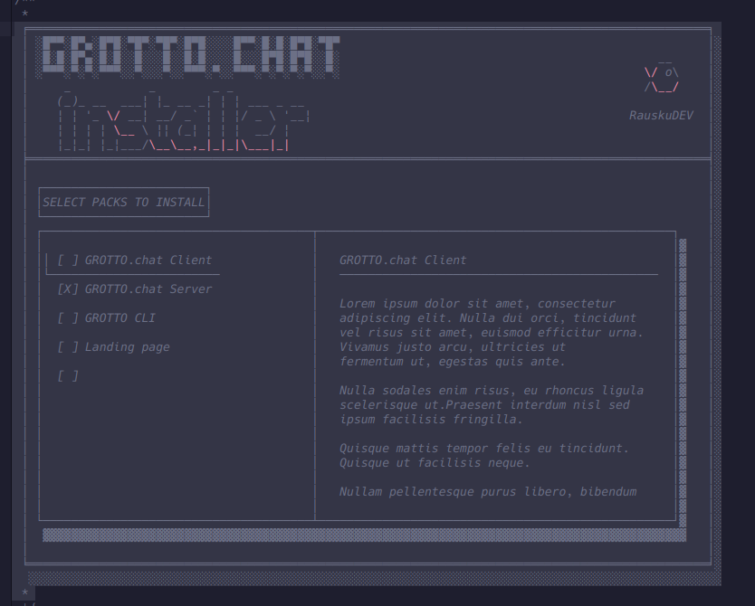

GROTTO.chat – Installer Planning Handover

Project GROTTO.chat

---

End-to-end encrypted chat and voice application for friend groups.
Combines irssi-style minimal terminal aesthetics with modern features:

Signal Protocol E2E encryption
voice rooms
file transfers
link previews
lightweight native clients

**Design goal: extremely low resource usage and self-hostable alternative to Discord-style platforms.**

Example observation:

> GROTTO.chat client ≈ few MB RAM
> Discord ≈ hundreds of MB

### Target audience:

small friend groups
self-hosters
people leaving Discord-style ecosystems
users who like IRC-style minimal tools

### Current situation:

Project is multi-repo.
Typical structure includes things like:


```bash
GROTTO.chat
GROTTO.chat-client
GROTTO.chat-server
GROTTO.chat-server-api
GROTTO.chat-server-tui
GROTTO.chat-android
GROTTO.chat-infra
GROTTO.chat-landing
```


### The project already includes:

C++ components
terminal UI components
FTXUI usage elsewhere in the project
Android client
infrastructure repo
documentation site

## Problem to solve

  **Installation is currently too complex for end users.**

- Typical developer install might involve:
  > git clone
  > cmake
  > build
  > configure
  > start services


**Most users will not attempt this.**

Goal: one-command installation experience.


## Planned solution:

Create a two-stage installer system.

### Stage 1 – bootstrap

Very small script.

_Linux example:_

`curl -fsSL https://chat.rausku.com/install.sh | bash`

_Windows example:_

`irm https://chat.rausku.com/install.ps1 | iex`

Responsibilities:

  - detect OS
  - detect architecture
  - download correct installer binary
  - launch installer

Nothing else.

### Stage 2 – binary installer

Binary application called:

`GROTTO.chat-installer`

Built with FTXUI.

Reason:

  - Already used in project
  - Mo extra UI dependency
  - Good for wizard style UI
  - Installer UX goal
  - Terminal wizard.


## Example layouts:




```bash

   __|   _ \    _ \   __ __|  __ __|    _ \              |              |
  (_ |     /   (   |     |       |     (   |        _|     \     _` |    _|
 \___|  _|_\  \___/     _|      _|    \___/   _)  \__|  _| _|  \__,_|  \__|

                     %random_slogan%
```

```bash

   ▄████  ██▀███   ▒█████  ▄▄▄█████▓▄▄▄█████▓ ▒█████
  ██▒ ▀█▒▓██ ▒ ██▒▒██▒  ██▒▓  ██▒ ▓▒▓  ██▒ ▓▒▒██▒  ██▒
 ▒██░▄▄▄░▓██ ░▄█ ▒▒██░  ██▒▒ ▓██░ ▒░▒ ▓██░ ▒░▒██░  ██▒
 ░▓█  ██▓▒██▀▀█▄  ▒██   ██░░ ▓██▓ ░ ░ ▓██▓ ░ ▒██   ██░
 ░▒▓███▀▒░██▓ ▒██▒░ ████▓▒░  ▒██▒ ░   ▒██▒ ░ ░ ████▓▒░
  ░▒   ▒ ░ ▒▓ ░▒▓░░ ▒░▒░▒░   ▒ ░░     ▒ ░░   ░ ▒░▒░▒░
   ░   ░   ░▒ ░ ▒░  ░ ▒ ▒░     ░        ░      ░ ▒ ▒░
 ░ ░   ░   ░░   ░ ░ ░ ░ ▒    ░        ░      ░ ░ ░ ▒
       ░    ░         ░ ░                       ░ ░

                 %random_slogan%
```

### Hero block installer-paneeliin

  - Tämä olisi erittäin käyttökelpoinen oikean puolen tekstialueen yläosaan.

```bash
╔══════════════════════════════════════════════════════╗
║   ____ ____   ___ _____ _____ ___                    ║
║  / ___|  _ \ / _ \_   _|_   _/ _ \                   ║
║ | |  _| |_) | | | || |   | || | | |                  ║
║ | |_| |  _ <| |_| || |   | || |_| |                  ║
║  \____|_| \_\\___/ |_|   |_| \___/                   ║
║       ___| |__   __ _| |_                            ║
║      / __| '_ \ / _` | __|                           ║
║     | (__| | | | (_| | |_                            ║
║      \___|_| |_|\__,_|\__|                           ║
║                                                      ║
║      %random_slogan%                                 ║
╚══════════════════════════════════════════════════════╝
```

```bash

   ██████╗ ██████╗  ██████╗ ████████╗████████╗ ██████╗
  ██╔════╝ ██╔══██╗██╔═══██╗╚══██╔══╝╚══██╔══╝██╔═══██╗
  ██║  ███╗██████╔╝██║   ██║   ██║      ██║   ██║   ██║
  ██║   ██║██╔══██╗██║   ██║   ██║      ██║   ██║   ██║
  ╚██████╔╝██║  ██║╚██████╔╝   ██║      ██║   ╚██████╔╝
   ╚═════╝ ╚═╝  ╚═╝ ╚═════╝    ╚═╝      ╚═╝    ╚═════╝

              %random_slogan%
```

```bash

┌──────────── GROTTO.chat Installer ────────────┐
|                                               | 
|  Install GROTTO.chat server on this machine.  |
'-----------------------------------------------'
   Server name:      GROTTO.chat.local
   Listen address:   0.0.0.0
   Port:             6697
   Data directory:   /opt/GROTTO.chat/data

   [x] Enable TLS
   [x] Install systemd service
   [x] Start after install

   [ Back ]                 [ Install ]

└──────────────────────────────────────────────┘

```


Progress screen:

  - Checking dependencies
  - Downloading server
  - Creating config
  - Installing service
  - Starting GROTTO.chat

Final screen:

  - GROTTO.chat installed successfully

  - Server port: 6697
  - Config: /opt/GROTTO.chat/config.json
  - Logs:   /opt/GROTTO.chat/logs

  - Docs: `https://wisdom.grotto.chat/`

### Installer responsibilities

The installer should:

  - Preflight checks
  - detect OS
  - detect systemd
  - check required permissions
  - check port availability
  - check disk space


**Configuration:**

Collect values for:

  - what packs to install (Server, Backend, Client, etc)
  - implement git modules from packs? or better ideas?
  - install_path
  - data_path
  - server_name
  - listen_address
  - port
  - tls_enabled
  - install_service
  - start_after_install
  - Installation tasks


**Install process:**

  - unpack server binary
  - create directories
  - generate config
  - install systemd service
  - start server
  - verify server startup


## Internal installer architecture

Suggested structure:

GROTTO.chat-installer

```structure
 grotto-chat-installer/
 ├ src
 │  ├ main.cpp
 │  ├ screens
 │  ├ install
 │  ├ system
 │  └ ui
 ├ assets
 ├ CMakeLists.txt
 └ README.md
```

Conceptual separation:

```concept
UI layer (FTXUI)
↓
Install configuration model
↓
Install pipeline
```

```c++
/* Example config struct: */

struct InstallConfig {
    std::string install_path;
    std::string data_path;
    std::string listen_address;
    int port;
    bool enable_tls;
    bool install_systemd;
    bool start_after_install;
};

InstallResult RunInstall(const InstallConfig& cfg);

```

---

 
# Distribution strategy

Prefer prebuilt server binaries.

Avoid:

 - installer building from source

Reasons:

- compiler issues
- distro differences
- slow install
- higher failure rate

Better:

installer + prebuilt GROTTO.chat-server binary
Additional future tools


*Possible later utilities:*

`GROTTO.chat doctor\ 
GROTTO.chat update\
GROTTO.chat uninstall`

Doctor command could check:

✔ port reachable
✔ config valid
✔ server running
✔ TLS configured


## Important project philosophy

_GROTTO.chat is not trying to be Discord._

Avoid:

  - gamification
  - stickers
  - boosts
  - unnecessary features

Focus on:

 - minimal
 - fast
 - private
 - self-hosted
 - Docs


Project documentation:

https://wisdom.grotto.chat/

